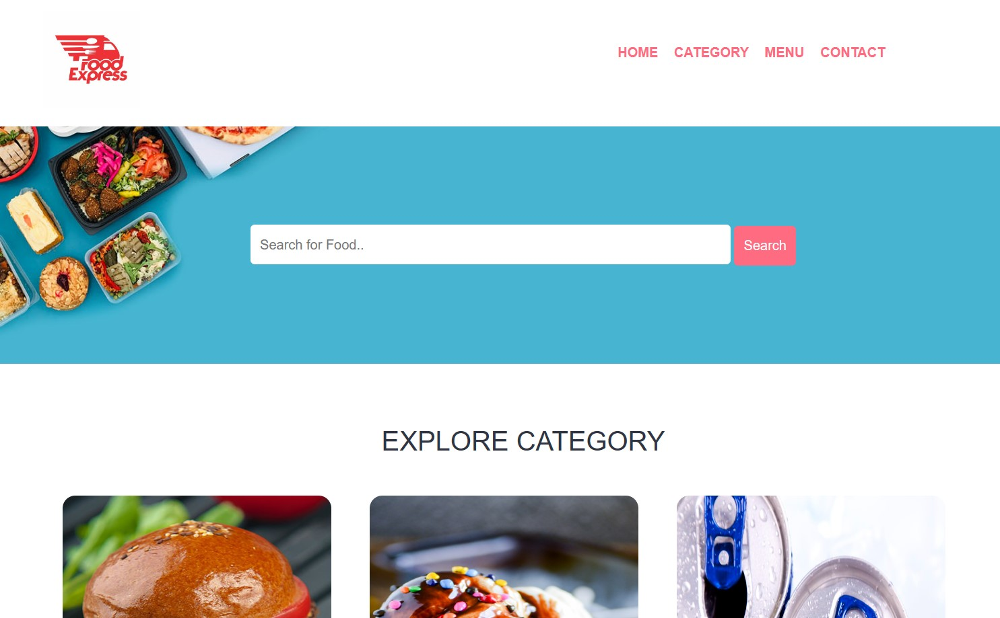
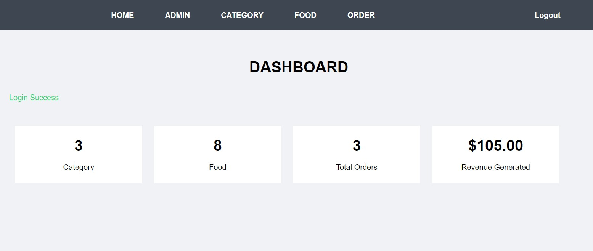

  # FOOD ORDER
  
  ## Setting
 - Download the project on github and run the project with hompage /:
 - To access the admin page click on the link /admin/login with username = admin ,password = 123456
 - To connect to database in the config/constanst.php to change database name ,username ,passoword 

## About Project

Website that sells fast food and delivers it to other customers upon request, with a variety of food menus for users to choose from.

## Technology used
- Pure Php processing to make the website
- HTML/CSS , Javascript 
- Use [Boostrap] version 5 support make UI(https://getbootstrap.com/).

## Main function
 - Login ,logout to get access to the admin dashboard
 - Add , Edit , Delete products ,admin users ,category ,order in Admin panel
 - View order and user information
 - Add product to cart
 - Update and delete product in cart

## Overview Website

 - Customer UI
    

      
     

 - Admin Pannel

  

  
  

## Website source code
 - [Visit to get the link](https://github.com/minhlam3118410220/food-order)

## License

The project makes it accessible to everyone to learn how to build a better website
